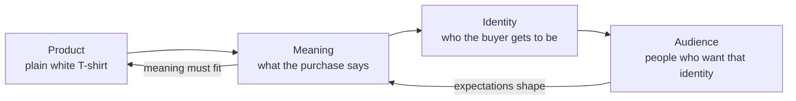

# Chapter 2: Brand Archetypes and Meaning

In Chapter 1, the same plain white T-shirt changed meaning depending on how it was framed. Framing explains *how* a message shifts emphasis. This chapter is about *what* the message is pointing at: the identity a brand offers you.

Every brand-name shirt you can buy is, physically, cotton. What separates a $12 shirt from a $120 shirt is rarely 10x the cotton. It is the story attached to it — and stories have recognizable shapes.

All brand scenarios, headlines, and product concepts in this chapter are hypothetical teaching examples. They are not claims about real companies.

## What an Archetype Is

**An archetype is a recurring character pattern that audiences already recognize.** The rebel. The caretaker. The wise teacher. You do not need these explained to you, because you have met them in stories your whole life.

Branding borrows this idea for a practical reason: recognition is cheap. If a brand behaves like a familiar pattern, an audience can understand it quickly, without a paragraph of explanation.

The useful question is not "what is our personality?" It is:

> **What does the audience get to feel, imagine, or become by choosing this brand?**

That phrasing matters. An archetype is not a description of the company. It is a description of the role the customer gets to play.

Read the arrows in both directions. Meaning flows outward from the product, but audience expectations flow back and constrain what the product can credibly claim. A shirt that falls apart after four washes cannot sustain a "built for the trail" identity for long.

## A Working Set of Archetypes

There is no single official list. The twelve below are a widely used working set in branding practice. Treat them as vocabulary, not as a scientific taxonomy.

| Archetype | Core promise | The buyer gets to be | Typical tone |
| --- | --- | --- | --- |
| Innocent | Simplicity and honesty | Uncomplicated, decent | Warm, plain, optimistic |
| Everyperson | Belonging without pretense | Normal, included | Friendly, unfussy |
| Hero | Effort rewarded | Capable, disciplined | Direct, energetic |
| Caregiver | Protection and comfort | Responsible, kind | Gentle, reassuring |
| Explorer | Freedom and discovery | Independent, curious | Open, restless |
| Rebel | Rules broken on purpose | Unbought, honest about it | Blunt, confrontational |
| Lover | Beauty and closeness | Desirable, attentive | Sensual, intimate |
| Creator | Making something new | Imaginative, skilled | Playful, precise |
| Jester | Permission not to take it seriously | Fun, self-aware | Irreverent, quick |
| Sage | Understanding before action | Informed, discerning | Calm, evidence-first |
| Magician | Transformation | Changed, elevated | Suggestive, visionary |
| Ruler | Order and standards | In control, high-status | Formal, authoritative |

Two brands can share an archetype and still feel nothing alike. A Sage that teaches patiently and a Sage that lectures condescendingly are running the same pattern with very different manners. The archetype sets the *role*; execution sets the *character*.

## Three Shirts, One Shirt

Here is the test. Hold the physical product constant — a well-made cotton crew-neck in white — and change only the archetype.

### Version A — The Sage: "Know What You're Wearing"

**The pitch:** the shirt is explained, not sold. The page leads with fabric weight in GSM, staple length, the knit structure, shrinkage after five washes, and a measured comparison against a cheaper shirt.

**Sample copy:** "180 GSM combed cotton. Here is what that means, and when it doesn't matter."

**What the buyer becomes:** someone who no longer gets fooled by vague words like *premium*. The purchase is an education.

**Where it works:** audiences who have been burned by marketing language and want a way to evaluate claims themselves.

### Version B — The Rebel: "No Logo. That's the Point."

**The pitch:** the blankness of the shirt is reframed as refusal. You are not a billboard. The brand positions itself against the entire practice of putting names on people's chests.

**Sample copy:** "You're not sponsored. Stop dressing like you are."

**What the buyer becomes:** someone who opted out — visibly, but without shouting.

**The tension to watch:** a brand selling anti-branding is still branding. Done honestly, that irony is acknowledged. Done cynically, it is hidden, and the audience eventually notices.

### Version C — The Caregiver: "Soft Enough for the Hard Days"

**The pitch:** the shirt is comfort. Hypoallergenic finish, flat seams that don't irritate, a cut that works during chemotherapy or after surgery or on a day you could not manage buttons.

**Sample copy:** "Easy to get on. Easy to wear all day. Easy to wash a lot."

**What the buyer becomes:** someone taking care of a body — their own or someone else's.

**Where it works:** the buyer is often not the wearer. A daughter buying for a parent responds to different language than the parent would.

### The Same Shirt, Compared

| | Sage | Rebel | Caregiver |
| --- | --- | --- | --- |
| **Headline** | Know what you're wearing | No logo. That's the point. | Soft enough for the hard days |
| **First thing shown** | A specifications table | A blunt line of type on white | A close-up of a flat seam |
| **Emotional offer** | Confidence in your judgment | Refusal, self-possession | Relief, being looked after |
| **Persuasion lever (Ch. 1)** | Authority, honest evidence | Unity, shared identity | Liking, reciprocity |
| **Proof it needs** | Real, checkable measurements | Consistent behavior over time | Genuine accessibility testing |
| **How it fails** | Becomes a spec sheet nobody reads | Becomes a pose it can't back up | Becomes pity, or condescension |
| **Price it can support** | Mid — justified by fact | Mid-high — justified by stance | Mid-high — justified by care |

Notice the last two rows. Each archetype carries its own failure mode and its own burden of proof. Choosing an archetype is choosing what you will have to be good at.

## Archetypes Are Not Destiny

This is the part most easily gotten wrong.

**Archetypes are cultural patterns, not personality diagnoses.** They describe shapes that recur in stories, not fixed types that people or companies belong to. A few consequences follow:

- **Brands mix.** Most real brands run a dominant archetype with a secondary one — a Hero with a Sage streak reads as a coach rather than a drill sergeant. Pure archetypes are rare and often feel like cartoons.
- **Brands move.** A Rebel that grows large usually drifts toward Everyperson or Ruler, whether it intends to or not. Scale changes what an audience is willing to believe about you.
- **Context decides meaning.** "Rebel" is not a universal signal. What reads as independence in one culture, generation, or industry reads as unprofessional or rude in another. The pattern is recognizable; its *value* is local.
- **Audiences are not archetypes.** The Explorer archetype does not mean your customers are explorers. It means the brand offers them the *feeling* of exploring — often on a commute, in a city, in a shirt.
- **It is not a personality test.** The frameworks that assign archetypes to individual people are a different and more contested claim than the branding use described here. This chapter makes the narrower claim: archetypes are useful shorthand for organizing communication.

The honest version of this framework sounds like: *we chose a familiar story shape because it helps people understand us faster.* The dishonest version sounds like: *we discovered our true brand soul.*

## Questions to Ask When Choosing an Archetype

Work through these before committing. Each one has a way of failing that is worth naming.

1. **What does the audience get to become?** Write it as a sentence starting with "Because I chose this, I am someone who…". If you cannot finish that sentence, you have a product description, not a positioning.
2. **Can we actually back it up?** Every archetype writes a check. Sage needs real data. Caregiver needs real accessibility work. Ruler needs real quality control. Which check can you cash?
3. **Would this survive a skeptical reader?** Imagine a customer who assumes you are exaggerating. Does anything here still hold?
4. **Does it differ from our competitors?** If four brands in the same aisle all run Hero, the archetype has stopped doing the one job it had: quick recognition.
5. **Is it consistent across every touchpoint?** A Rebel with a groveling customer-service script is not a Rebel. Archetype lives in return policies and error messages, not just headlines.
6. **What happens when we scale or change?** Choose a pattern you can still run at ten times the size, or plan the transition deliberately.
7. **Who does this exclude, and are we comfortable with that?** A strong archetype always excludes someone. Knowing who is a strategy. Not knowing is an accident.
8. **Where could this become manipulative?** Caregiver can slide into exploiting anxiety. Unity can slide into "people like us don't ask about price." Name the risk in advance so you can watch for it. (Chapter 1's persuasion/manipulation distinction applies directly here.)

If your answers to 1 and 2 disagree — the identity is thrilling, the proof is missing — fix the product or change the archetype. Do not fix it with adjectives.

## Explore Further

These are **suggestions for external research**, not sources already reviewed for this chapter. Use a library catalog or scholarly search tool:

- Search **Carl Jung archetypes collective unconscious criticism**. Archetype theory originates in analytical psychology; find out how that field evaluates it today, and note the gap between psychological theory and marketing practice.
- Search **brand archetypes marketing framework evidence**. Look specifically for whether anyone has tested the framework's predictive claims, rather than just asserted them.
- Search **brand positioning differentiation category entry points**. Compare an archetype-based account with a positioning-based one.
- Pick two real competing brands in one category. Without reading their marketing copy, judge their archetype from their packaging, site layout, and customer-service tone alone. Then read their copy and see if it matches.

When you evaluate a source, check whether it reports evidence or sells consulting. Both can be useful; they are not the same kind of claim.

## What You Should Remember

- An archetype is a familiar story shape that lets an audience understand a brand quickly; the real question is what the buyer gets to *become*.
- The same physical product supports wildly different archetypes — the shirt does not change, the identity on offer does.
- Archetypes are cultural patterns and communication tools, not personality diagnoses; brands blend them, drift between them, and read differently across contexts.
- Every archetype comes with a burden of proof and a characteristic failure mode. Pick the one whose check you can cash.
- Archetype answers *what meaning*; Chapter 1's persuasion answers *what response*; Chapter 3 takes up *how it should look*.
