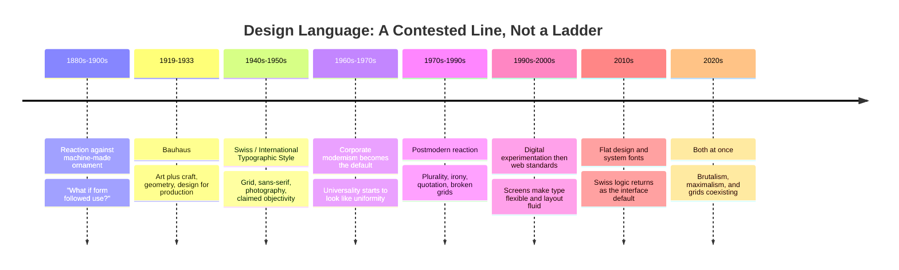

# Chapter 3: Modernism, Postmodernism, and Visual Language

Chapter 1 asked what response you want. Chapter 2 asked what meaning you are offering. This chapter asks the third question: **how should that meaning look?**

Design is not decoration applied after the thinking. A grid, a typeface, and an amount of empty space are arguments about how the world should be organized. People have fought about these arguments for a century, and the fight is still visible on the website you opened this morning.

All T-shirt concepts and sample copy in this chapter are hypothetical teaching examples. Historical movements are described in general terms; specific objects are left for you to verify yourself in the Museum Research section.

## Before Modernism: Ornament as Proof

For most of the nineteenth century, visual richness signaled value. Industrial production made decoration cheap to reproduce, so manufactured goods were covered in it — carved surfaces, elaborate borders, type designed to shout from a poster.

By the end of the century, a reaction had set in. If ornament could be stamped out by machine, it no longer proved craft or expense. Designers and architects across Europe began asking a different question: what would an object look like if it were shaped by what it *does* rather than by what it should *resemble*?

That question is the seed of modernism.

## Bauhaus: The School That Argued With Itself

The Bauhaus was a German design school founded in 1919 in Weimar, later moving to Dessau and then Berlin, and closed in 1933 under political pressure from the Nazi regime. Its staff and students scattered internationally — which is a large part of why its ideas spread so far.

What made it influential was less a single style than a teaching argument:

- **Unify art and craft.** A chair designer and a painter should be trained in the same workshop, on the same foundational course in color, material, and form.
- **Design for production.** An object should be designed so it can be made well many times, not once as a luxury.
- **Let form follow use.** Strip away what the object does not need to do its job.
- **Start from primitives.** Geometry, primary color, and simple type were treated as a shared, teachable base.

It is worth knowing that the Bauhaus was internally contradictory — its early years leaned mystical and expressionist, its later years industrial and rationalist — and that its record on who got to study what was uneven, with women frequently steered into the weaving workshop. Treating it as one coherent doctrine flattens a school that spent fourteen years disagreeing with itself.

## Swiss Style: Modernism Gets a Method

After the Second World War, designers in Switzerland — working in a small, multilingual country where a poster might need to function in German, French, and Italian — pushed modernist ideas into a repeatable system. It is called the International Typographic Style, or simply Swiss Style.

Its toolkit is specific enough to recognize on sight:

- a **mathematical grid** underlying the whole layout
- **sans-serif type**, often in a single family with limited weights
- **flush-left, ragged-right** text instead of justified blocks
- **asymmetric composition** balanced by the grid rather than by centering
- **photography instead of illustration**, treated as evidence
- **white space as an active element**, not leftover room
- **objectivity as an ideal** — the designer's hand deliberately not visible

The ambition was universality: a visual language that worked across languages and cultures because it relied on structure and image rather than on local decoration. Airport signage, transit maps, and most corporate identity systems of the mid-twentieth century come out of this thinking.

## Postmodernism: The Argument Back

By the 1960s and especially the 1970s and 1980s, a reaction was building. The objection was not that Swiss Style was ugly. It was that its central claims were doubtful.

The postmodern critique, roughly:

- **"Universal" was never universal.** A style produced by a specific group in a specific place was being sold as neutral and human-wide. Neutrality is itself a position.
- **"Objective" hides the author.** Removing visible authorship does not remove the author's choices. It just makes them harder to question.
- **Clarity is not the only value.** Ambiguity, humor, historical reference, and pleasure are legitimate things for a design to produce.
- **Reduction can erase.** What gets stripped away in the name of essentials is often exactly the local, the ornamental, and the culturally specific.

So postmodern design did the opposite on purpose: layered and tilted type, clashing color, borrowed historical motifs used with irony, deliberately broken grids, visible seams. Type could be stretched, overlapped, or made partly illegible — because legibility was being treated as one goal among several rather than the goal.

The point was rarely chaos for its own sake. It was **plurality**: the insistence that there is no single correct visual language, and that a design can quote, joke, and argue.

## The Comparison

| | Modernist / Swiss | Postmodern |
| --- | --- | --- |
| **Underlying belief** | There is a best, clearest solution | There are many valid solutions |
| **Grid** | Strict, mathematical, load-bearing | Broken, ignored, or mocked |
| **Typography** | One sans-serif family, few weights | Mixed families, historical quotation, distortion |
| **Color** | Limited, often primary or monochrome | Abundant, clashing, unexpected |
| **Ornament** | Removed as dishonest | Restored as meaningful |
| **The designer** | Invisible, objective | Present, opinionated, sometimes joking |
| **Space** | Generous, structural | Filled, layered, compressed |
| **Reading it feels like** | Being informed | Being addressed |
| **Failure mode** | Cold, generic, interchangeable | Illegible, self-indulgent, dated fast |
| **What it's good at** | Wayfinding, data, trust at scale | Identity, memorability, cultural specificity |

Read the last two rows together. Neither column is correct. Each is a set of trade-offs, and the choice depends on what the design has to accomplish.

The timeline is a simplification. These movements overlapped, ran in parallel, and were never as tidy as a diagram implies — the value of the diagram is the *shape* of the argument, not the precision of the dates.

## Where the Tension Lives Now

History did not resolve into a winner. Six unresolved tensions still show up in contemporary work:

| Tension | Modernist pull | Postmodern pull | Where you see it today |
| --- | --- | --- | --- |
| Order vs. disruption | 8-point spacing systems | Deliberately "wrong" layouts | Design systems vs. brutalist portfolio sites |
| Universality vs. identity | One design system, all markets | Local, specific, untranslatable | Global product UI vs. regional campaigns |
| Clarity vs. expression | Plain labels, obvious buttons | Playful microcopy, odd motion | Banking apps vs. fashion and music sites |
| Grid vs. anti-grid | 12-column responsive grids | Overlapping, off-axis composition | Dashboards vs. editorial features |
| Restraint vs. abundance | White space, one accent color | Dense collage, gradients, noise | Enterprise software vs. streetwear drops |
| Function vs. irony | The button says "Buy" | The button makes a joke | Checkout flows vs. brand landing pages |

A useful pattern: products that need **trust and repeat use** drift modernist. Products that need **attention and distinctiveness** drift postmodern. Many organizations run both — a playful marketing site handing you off to a sober, gridded application.

## How to Read a Design

You can analyze any poster, page, or product screen with a short sequence. Try it on something in front of you right now.

1. **What do you see first, and why?** Is it the largest element, the most contrasting, the only face, the only color? Trace the deliberate path your eye was given.
2. **Find the structure.** Are edges aligned? Draw imaginary vertical lines down the layout. A grid you can find is a modernist signal; alignments that keep breaking are often intentional.
3. **Count the typefaces and weights.** One or two with limited weights suggests systematic thinking. Four or more suggests expression — or carelessness. The difference is whether the mixing looks *decided*.
4. **Look at the empty space.** Is it generous and even, or is every area filled? Is emptiness doing work, or is it just leftover?
5. **Look for ornament.** Is there anything that serves no informational purpose? What is it *referencing* — another era, another medium, another culture?
6. **Ask who is speaking.** Does this feel authored by a person with opinions, or issued by an institution? Both are constructed effects.
7. **Name what it wants.** Inform, seduce, reassure, provoke, or entertain? Now check: does the visual language actually serve that, or is it borrowed because it looked good elsewhere?
8. **Ask who it is for — and who it shuts out.** Small light-gray type excludes people with low vision. Heavy cultural references exclude those without them. Sometimes that exclusion is a choice; often it is an oversight.

Step 7 is where most weak design is caught. Visual language copied without a reason usually announces itself.

## Museum Research

To see these ideas in real objects rather than descriptions, go to institutional collections. Museum catalogs are useful specifically because entries are written by curators and include provenance, date, medium, and dimensions that you can check.

**Do not take the examples below as a list of objects that exist in a particular form — these are search terms. Find the actual object, read the actual catalog entry, and verify it yourself.**

Collections worth searching online:

- **The Museum of Modern Art (MoMA)** — strong architecture and design collection, including Bauhaus-era objects and graphic design
- **The Metropolitan Museum of Art** — broad historical range, useful for seeing what modernism was reacting *against*
- **Cooper Hewitt, Smithsonian Design Museum** — design-specific, with a searchable online collection
- **Victoria and Albert Museum (V&A), London** — extensive posters, typography, and twentieth-century design
- **Bauhaus-Archiv / Museum für Gestaltung, Berlin** and the **Bauhaus Dessau Foundation** — primary Bauhaus holdings
- **Museum für Gestaltung Zürich** — a major collection of Swiss poster design
- **Letterform Archive** — typography and graphic design specifically

Search terms to try:

- `Bauhaus poster typography` and `Bauhaus Dessau workshop`
- `International Typographic Style poster`
- `Swiss poster design 1950s Zurich Basel`
- `Josef Müller-Brockmann grid systems`
- `Armin Hofmann poster`
- `Wolfgang Weingart typography` — often described as a bridge out of strict Swiss Style
- `April Greiman digital design` and `Wolfgang Weingart New Wave`
- `postmodern graphic design 1980s` and `Memphis Group design`
- `Emigre magazine typography 1990s`

**How to work through what you find:**

1. Pick one modernist object and one postmodern object from an actual collection.
2. Record the real catalog data — designer, date, medium, museum, accession or object number.
3. Run the eight-step "How to Read a Design" sequence on each.
4. Write two sentences on what each object assumes about its viewer.
5. Note anything the catalog entry says that contradicts the tidy account in this chapter. It will happen, and that is the most valuable part of the exercise.

Verify everything against the museum's own catalog entry. If you cannot find an object, do not describe it as though you did.

## Back to the Shirt

Same shirt. Same cotton. Same price, even. Only the visual language changes.

### The Modernist Presentation

A white page. The shirt photographed straight-on, evenly lit, centered on a 12-column grid, no model. One sans-serif family in two weights. A small specifications table below: weight in GSM, fiber, measurements per size, country of manufacture. Generous white space. One accent color used exactly once, on the button.

**It reads as:** an object with knowable properties. The absence of persuasion becomes the persuasion — nothing here is being hidden, because nothing is being performed.

**Archetype fit (Chapter 2):** Sage, or a restrained Ruler.

**Headline:** `White T-Shirt. 180 GSM. Five sizes.`

### The Postmodern Presentation

The shirt photographed on a flatbed scanner, slightly crumpled, edges cut off. Type in three families — a condensed sans, a quotation of 1970s serif, and something that looks like a receipt printer — overlapping the image at angles. A color pairing that should not work. A visible dotted line and a stray asterisk that never resolves to a footnote.

**It reads as:** a cultural object with a point of view. It assumes you are in on the joke and that you have seen a thousand clean product pages.

**Archetype fit:** Rebel, Jester, or Creator.

**Headline:** `IT'S A WHITE SHIRT*` `*we know`

Both pages sell the same cotton. The first invites you to evaluate. The second invites you to belong. Neither is more honest by default — the modernist page can hide a bad product behind clean type just as easily as the postmodern page can hide it behind a joke.

## What You Should Remember

- Visual language carries arguments: a grid, a typeface, and empty space all express beliefs about how information and people should be treated.
- Modernism — through the Bauhaus and the Swiss International Typographic Style — pursued clarity, structure, reduction, and claimed universality.
- Postmodernism answered that "universal" and "objective" were positions in disguise, and restored plurality, irony, quotation, and expression.
- The tensions between order and disruption, clarity and expression, restraint and abundance are unresolved and visible in current digital design.
- Read any design by finding its structure, its typefaces, its empty space, and its intent — then ask whether the visual language actually serves what the thing is trying to do.
- Verify historical examples in real institutional collections; search terms are a starting point, not a citation.
