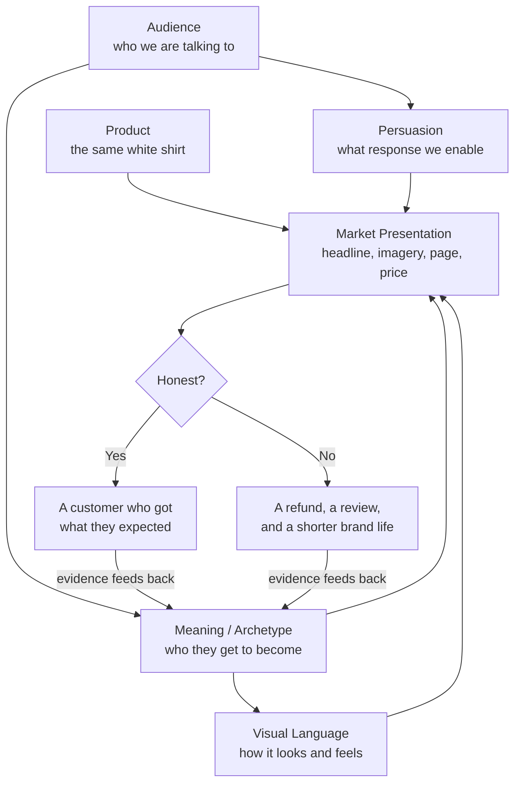

# Chapter 4: The Plain White T-Shirt Case Study

Here is our product.

It is a crew-neck T-shirt. It is white. It is 180 GSM combed cotton, side-seamed, with a ribbed collar that holds its shape. It costs about $9 to make well. Five sizes. That is the entire product.

Now watch five companies sell it for between $14 and $340 without changing a single thread.

Everything in this chapter is invented for teaching purposes — the brands, headlines, prices, and stories are all hypothetical. No real company is being described. The point is the machinery, not the marketing.

## The Machinery

Before the concepts, the assembly. Five inputs combine into one market presentation:

Two things about this diagram. First, **audience drives both meaning and persuasion** — you cannot choose an archetype without knowing who is receiving it. Second, **the loop at the bottom is the part that gets skipped.** A presentation that overpromises does not fail immediately. It fails on the second purchase that never happens.

## Concept 1 — MERIDIAN

### "Everywhere You're Going."

**Audience:** 24–38, urban, travels more than average, owns fewer things on purpose. Has a carry-on opinion.

**Archetype:** Explorer. The buyer becomes someone unbound — a person whose life does not require a closet.

**Persuasion (Ch. 1):**
- **Consistency** — "you said you wanted to travel light" becomes a reason to own less
- **Social proof** — traveler reviews from named cities, including the ones who hated the fit
- **Authority** — an actual textile technician explains the merino-cotton blend's odor performance, with the test conditions stated

**Visual language:** Modernist with warmth. A grid, but photographs shot in real light in real places — a train window, a launderette at night, a hostel sink. One sans-serif. Lots of air. Deliberately *not* an adventure-brand aesthetic: no mountains, no drone shots, no one leaping.

**Imagery direction:** The shirt is rarely the subject. It is worn in the frame while something else happens. Crucially, at least one image shows it wrinkled, because it will be.

**Product story:** "We got tired of packing four shirts for four days. So we built one that handles a flight, a meeting, and a night out, and dries on a hotel radiator by morning. It is not magic. It is a knit structure and a fiber blend, and here is exactly what it will and will not do."

**What the customer is actually buying:** permission to own less. The shirt is a proof that their life can be lighter than it is.

**Price it supports:** $58.

**Ethical risk:** Explorer branding sells freedom to people who are mostly commuting. The fantasy is fine; the danger is **performance claims**. "Wear it four days" is a testable promise. If it starts smelling on day two, you have sold a fantasy as a specification. The fix is boring and effective: state the test conditions, and say what it cannot do.

## Concept 2 — WEIGHT

### "180 GSM. Combed Cotton. $34."

**Audience:** 28–45, has bought three "premium basics" that pilled, now reads product pages like a skeptic reads a lease.

**Archetype:** Sage. The buyer becomes someone who cannot be sold to anymore.

**Persuasion:**
- **Authority through verifiable specification** — every number is one you could check with a scale and a ruler
- **Reciprocity** — a free, genuinely useful guide to reading any shirt's spec sheet, including competitors'
- **The anti-scarcity move** — "we restock continuously; there is no reason to hurry"

**Visual language:** Strict Swiss. A 12-column grid you can see if you squint. Helvetica-descended sans in two weights. No model. The shirt shot flat, evenly lit, straight on. White space doing structural work. One accent color, used once, on the button.

**Imagery direction:** Product photography as evidence, not seduction — including a macro shot of the knit, a photo after twenty washes next to a new one, and a chart of measured shrinkage.

**Product story:** "Here is the shirt. Here is the fabric weight, the fiber, the knit, the measurements for every size, and the factory. Here is the same shirt after twenty washes. We think it is worth $34. You can now decide that for yourself."

**What the customer is actually buying:** the end of research. They are purchasing the feeling of having finally found the honest one.

**Price it supports:** $34.

**Ethical risk:** This is the most dangerous concept on the list, because **radical transparency is itself a persuasion technique.** A page that shows you fourteen real numbers builds enough trust that you stop checking the fifteenth. If the disclosed facts are true but selectively chosen — every flattering number, no unflattering one — the format is doing deceptive work while looking like the opposite. The test: does the page publish anything that costs it a sale?

## Concept 3 — NOT A BILLBOARD

### "YOU'RE NOT SPONSORED. STOP DRESSING LIKE IT.*"

*\*this shirt also has a brand. we're aware.*

**Audience:** 19–29, allergic to being marketed to, deeply online, capable of detecting a brand voice that is trying too hard from about four hundred meters.

**Archetype:** Rebel with a heavy Jester assist. The buyer becomes someone who opted out — and is honest that opting out is also a look.

**Persuasion:**
- **Unity** — an in-group formed by shared skepticism
- **Liking** — a voice that is funny and does not flatter you
- **Inverted authority** — the brand undercuts its own claims before you can

**Visual language:** Postmodern, committed. Shirt on a flatbed scanner, crumpled, cropped badly on purpose. Three clashing typefaces: a condensed sans, a quoted 1970s serif, and something that looks like a receipt printer. Overlapping layers. A dotted line that leads nowhere. Yellow and maroon, together, defiantly. A visible asterisk culture — footnotes on footnotes.

**Imagery direction:** Scans, photocopies, phone photos with the flash on. Zero styling. If it looks like a lookbook, it has failed.

**Product story:** "Companies pay athletes millions to wear their logo. You do it for free and pay $40 for the privilege. This shirt has no logo on the outside. It has one on the inside tag, because we are a company and pretending otherwise would be its own kind of lie."

**What the customer is actually buying:** the pleasure of being in on it. The shirt is a membership card for people who dislike membership cards.

**Price it supports:** $40.

**Ethical risk:** **Irony is a shield.** A brand that pre-mocks its own marketing has made criticism feel redundant — it already said the thing you were going to say. That is legitimate when the self-awareness is real and the product is good. It becomes manipulative when the joke is doing the work the product cannot do. A blank shirt at $40 still has to be a good $40 shirt. The joke is not the fabric.

## Concept 4 — MAISON BLANC

### "The White Shirt."

**Audience:** 35–60, high income, buys few things, considers price a signal of seriousness rather than a cost.

**Archetype:** Ruler, with Lover in the photography. The buyer becomes someone with standards — a person whose restraint is the point.

**Persuasion:**
- **Authority** — a named atelier, a stated mill, an eleven-step finishing process
- **Scarcity** — genuinely limited production runs, numbered
- **Consistency** — a customer who has bought quality before is being invited to continue being that person

**Visual language:** Modernist minimalism inflected toward luxury. Enormous margins. The shirt occupies maybe 18% of the screen. Type is small, wide-tracked, and set in a refined serif. Everything is slow: images fade, the cursor changes, the page does not hurry you. The absence of information is intentional — asking the price is positioned as slightly gauche.

**Imagery direction:** One photograph, perfectly lit, deep shadow, shot on medium format. A detail of the collar seam. A hand — never a face.

**Product story:** Four sentences, maximum. "Cut in a single atelier. Finished by hand. Produced in limited quantity each season. Ours is not the only good white shirt; it is the one we are willing to sign."

**What the customer is actually buying:** the confirmation that they can tell the difference. Which, notably, is a claim about *them*, not the shirt.

**Price it supports:** $340.

**Ethical risk:** The clearest one here. **The gap between $9 of cotton and $340 is not covered by hand-finishing, and everyone involved knows it.** That is not automatically fraud — you are permitted to sell craftsmanship, scarcity, and beauty. It becomes deceptive at the exact moment the page implies the *material* justifies the price. The honest luxury argument is "this is exceptionally made and deliberately rare." The dishonest one is a vague gesture at fabric that is, in fact, the same cotton as Concept 2 at a tenth the price.

## Concept 5 — SECOND SHIFT

### "Soft Enough for the Hard Days."

**Audience:** two distinct groups — people managing a chronic condition, a recovery, or a disability, *and* the family members buying for them. These two want very different language.

**Archetype:** Caregiver. The buyer becomes someone competently taking care of a body.

**Persuasion:**
- **Liking** — plain, warm, non-pitying language
- **Reciprocity** — a genuinely useful dressing guide, free, no account required
- **Social proof** — reviews specifically from people with the relevant conditions, including the negative ones

**Visual language:** Modernist clarity with the ideology removed and accessibility taken seriously. Large type by default. Contrast well above minimum. Flat seams photographed close. Every image captioned. Nothing clever, nothing that requires a mouse, nothing that moves unless you ask it to.

**Imagery direction:** Real people, unstyled, in their own homes. Hands fastening, sleeves being pulled. Ordinary rooms with ordinary light.

**Product story:** "Flat seams so nothing rubs. A wide neck opening so it goes on without raising your arms much. A finish that survives being washed every day. We tested it with people who need all three."

**What the customer is actually buying:** dignity that does not announce itself. A shirt that solves a problem without looking like medical equipment.

**Price it supports:** $44.

**Ethical risk:** The most serious on this list. **Caregiver marketing operates on people in difficulty, often people who are frightened.** Two specific failures: selling to the anxiety of the family member rather than the needs of the wearer, and making accessibility claims that were never tested with the people they name. If "tested with people who need it" is a phrase and not a process, this concept is exploiting vulnerability while wearing the costume of care. Of all five, this one most requires the claim to be literally true.

## The Synthesis Table

| | MERIDIAN | WEIGHT | NOT A BILLBOARD | MAISON BLANC | SECOND SHIFT |
| --- | --- | --- | --- | --- | --- |
| **Audience** | Light-packing travelers | Burned skeptics | Marketing-allergic young adults | High-income minimalists | People managing a body, and their families |
| **Archetype** | Explorer | Sage | Rebel + Jester | Ruler + Lover | Caregiver |
| **Persuasion levers** | Consistency, social proof, authority | Authority, reciprocity, anti-scarcity | Unity, liking, inverted authority | Authority, scarcity, consistency | Liking, reciprocity, social proof |
| **Visual language** | Warm modernism | Strict Swiss | Committed postmodern | Luxury minimalism | Accessible modernism |
| **Headline** | Everywhere You're Going. | 180 GSM. Combed Cotton. $34. | YOU'RE NOT SPONSORED.* | The White Shirt. | Soft Enough for the Hard Days. |
| **Actually buying** | Permission to own less | The end of research | Being in on it | Proof of discernment | Dignity, quietly |
| **Price** | $58 | $34 | $40 | $340 | $44 |
| **Biggest risk** | Untestable performance claims | Selective transparency | Irony covering a weak product | Implying material justifies price | Exploiting fear; untested claims |
| **The one thing it must be true about** | The fabric's actual performance | Every published number | The shirt being genuinely good | The making being genuinely exceptional | The accessibility testing |

## What This Chapter Actually Demonstrates

Look down the **Price** row: $34 to $340, tenfold, same cotton. Then look at the **Actually buying** row. Nobody in any of the five concepts is buying cotton. They are buying lightness, certainty, belonging, discernment, and dignity.

This is neither a scandal nor a trick. Meaning is a real thing that people genuinely want and will genuinely pay for. A shirt that makes someone feel capable on a hard morning has delivered something.

The line is in the last row of the table. **Every concept has exactly one thing it must not lie about** — and it is always the thing the price depends on. MERIDIAN may romanticize travel but must not overstate what the fabric does. MAISON BLANC may charge $340 for rarity but must not pretend the cotton is different. SECOND SHIFT may use warm language but must actually have done the testing.

Persuasion, archetype, and design language are tools for making meaning legible. The question they never answer for you is whether the meaning is true.

## What You Should Remember

- One unchanged physical product supports at least five coherent businesses at wildly different prices; the shirt is the smallest part of what is being sold.
- Audience comes first — it determines which archetype is credible and which persuasion levers are available.
- Archetype, persuasion, and visual language have to agree. A Sage brand in postmodern chaos reads as untrustworthy; a Rebel brand in a clean Swiss grid reads as corporate.
- Every positioning writes a check: a claim the price depends on and the brand must be able to cash.
- Every positioning also has a characteristic ethical failure — usually the shortcut that makes it work faster.
- Charging for meaning is legitimate. Lying about the thing the meaning rests on is not.
