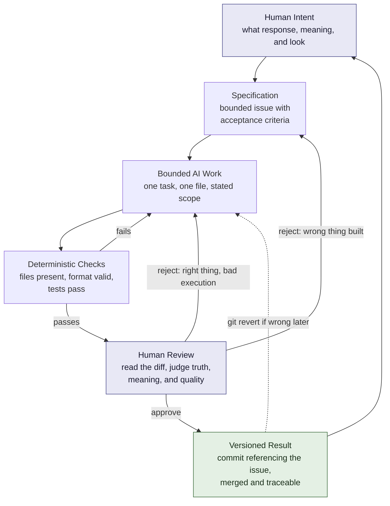

# Chapter 5: Synthesis — Three Lenses and a Pit Stop

You now have three lenses. This chapter is about what they are for.

They are not a marketing curriculum. They are a way of specifying intent precisely enough that someone else — a collaborator, a contractor, or an AI — can execute it without you having to redo it yourself.

That last case is the one this chapter is really about.

## The Three Questions

| Lens | Question it answers | What it produces |
| --- | --- | --- |
| **Persuasion** (Ch. 1) | What response are we trying to enable? | A behavior: understand, compare, trust, decide, decline |
| **Archetype** (Ch. 2) | What meaning or identity are we expressing? | A role the audience gets to occupy |
| **Design language** (Ch. 3) | How should that meaning look and feel? | Structure, type, space, color, tone |

Chapter 4 ran all three at once, five times over, on one white shirt.

The order matters. Response first, because it determines what success even means. Meaning second, because it has to be credible to that audience. Appearance last, because appearance without the other two is decoration chosen by taste.

Most weak creative work fails by starting at the third question.

## Why This Is a Control Framework for AI

Here is the practical connection, and it is the reason this chapter exists in a course about Git and terminals.

An AI assistant will produce something for almost any instruction. Ask for "a product page for a white T-shirt" and you will get one — competent, plausible, and generic, because a vague instruction gets averaged output. The model filled in the gaps you left, using the most statistically ordinary answer available.

Now specify:

> Response: a skeptical shopper should be able to verify our claims themselves and leave without buying.
> Meaning: Sage — the buyer becomes someone who can no longer be sold to.
> Look: strict Swiss grid, one sans-serif in two weights, no model, specification table above the fold, one accent color.

Same model. Same shirt. Radically less ambiguity — and now you can tell whether the output is *wrong*, which is the thing a vague prompt never lets you do.

**The three lenses are a specification language.** They convert taste into constraints, and constraints are what make AI output checkable.

## Bounded Tasks

Notice how each issue in this practical was shaped: one file, one topic, explicit acceptance criteria, no permission to reorganize the repository.

That shape is deliberate. A bounded task is one where:

- the **output location** is stated — `book/03-design-language.md`, not "somewhere in the book"
- the **acceptance criteria** are checkable before you read a word of prose
- the **scope limit** is explicit — do not touch other files
- **failure is visible** — you can tell, quickly, that it did not do the thing

Unbounded tasks ("improve the book") produce work you cannot evaluate without rereading everything. They also produce changes in places you were not watching. The smaller the blast radius, the cheaper the review.

## Deterministic Checks vs. Probabilistic Review

This distinction is worth internalizing, because the two get confused constantly.

| | Deterministic check | Probabilistic review |
| --- | --- | --- |
| **Example** | The GitHub Action in this repo | An AI reading your chapter for quality |
| **Question it answers** | Does the file exist? Is it non-empty? Is there a Mermaid block? | Is this clear? Is this argument sound? Is the tone right? |
| **Same input, same output?** | Always | Not guaranteed |
| **Can be wrong?** | Only if the rule is wrong | Yes, confidently and fluently |
| **Cost per run** | Near zero | Real, and grows with length |
| **Good for** | Structure, presence, format, syntax | Meaning, judgment, taste, "is this actually good" |
| **Bad for** | Anything requiring judgment | Anything you need to be certain about |

The workflow implication: **make everything you can deterministic, so that human attention is spent only where determinism cannot reach.**

The Action in this repository checks six files exist and are non-empty, counts commits containing `#N`, and counts Mermaid blocks. It has no opinion whatsoever about whether the chapters are any good. That is not a weakness — it is the division of labor. The cheap check runs on every push, forever, identically. The expensive judgment runs when a person decides it should.

A caution about AI review specifically: it is genuinely useful and genuinely unreliable in a particular way. It will tell you a chapter is well-structured and miss that a paragraph is false. It is a strong *first* reader and a weak *last* one.

## Why Git Matters More When AI Is Writing

Version control was already useful. AI generation makes it structural, for four reasons:

1. **Volume.** AI produces text faster than you can carefully read it. Without commits, "what changed" becomes unanswerable within a day.
2. **Traceability.** `git log` plus issue numbers means every paragraph has a provenance: which task asked for it, which prompt produced it, who approved it. When something turns out to be wrong, you can find out *why* it got written.
3. **Recovery.** The genuine advantage of AI is cheap attempts. Cheap attempts are only cheap if reverting is free. `git revert` is what makes experimentation rational rather than reckless.
4. **Reviewability.** A diff is the only honest report of what an AI changed. A summary of changes is a claim; the diff is the evidence. Read the diff.

That fourth point is the one students skip. The summary at the end of an AI response is generated text like everything else, and it describes what the model *intended* to do.

## The Pit Stop

A race car is not rebuilt mid-race. It runs, monitored constantly by automated telemetry — hundreds of sensors, thresholds, alarms — and none of that telemetry decides anything. It reports.

Then, at chosen moments, the car stops. For a few seconds a crew of people with hands and eyes does what no sensor can: changes what needs changing, and decides whether this car goes back out.

That is the shape of a good AI workflow.

- **The car running** is generation: fast, continuous, productive.
- **The telemetry** is your deterministic checks: constant, cheap, never tired, never insightful.
- **The pit stop** is human review: deliberate, scheduled, expensive, and where the actual decisions happen.

Three things follow from the metaphor:

- **Pit stops are chosen, not random.** You decide where they go — before a merge, before a publish, before anything a customer sees. Reviewing everything equally is the same as reviewing nothing carefully.
- **Telemetry never calls the race.** All green means nothing exceeded a threshold. It does not mean the strategy is right. Our Action can pass on six files of confident nonsense.
- **The crew is accountable.** If the car goes back out unsafe, "the sensors said it was fine" is not a defense. You committed it. Your name is on it.

The two shaded boxes at the top and middle are the human ones. Notice they sit at the beginning and at the gate — intent and judgment. Everything between them can be automated or delegated. Those two cannot, and the arrow from the versioned result back to human intent is what makes this a loop rather than a pipeline: shipping something teaches you what to specify next.

Notice also that **review has two different rejections.** "You built the wrong thing" goes back to the specification — that is your failure, not the AI's. "You built the right thing badly" goes back to the work. Distinguishing these is most of what makes someone good at directing AI.

## What Stays Human

Automation can check structure. AI can generate and can offer a probabilistic opinion. Neither can take responsibility, because responsibility requires someone who can be held to it.

Specifically, these remain yours:

- **Intent** — what is worth building, and why
- **Truthfulness** — whether the claims are actually true; a model cannot know what it does not know it does not know
- **Context** — what this audience, this organization, this moment requires
- **Judgment** — whether "acceptable" is good enough here
- **Meaning** — whether the thing being communicated is worth communicating
- **Ethics** — every risk named in Chapter 4 was a human decision, not a formatting error
- **The final call** — you merged it, so it is yours

That last one is not a moral flourish. It is how it actually works. When a claim in this book turns out to be wrong, the `git blame` says your name.

## Questions for Next Week

Bring answers. These are worth actual thought, not a sentence each.

1. Take something you use daily — an app, a site, a product. Name its archetype, its dominant persuasion levers, and its design language. Do the three agree with each other? Where do they conflict?
2. Write a specification for a bounded AI task in your own work. What is the output file, and what are three criteria a machine could check without judgment?
3. Of the five Chapter 4 concepts, which ethical risk is the hardest to detect from the outside, as an ordinary customer? What would you have to know to catch it?
4. Find a deterministic check this repository's Action *could* run but does not. Why might the instructor have left it out?
5. Describe a time an AI produced something plausible and wrong for you. What check would have caught it — and was it deterministic or human?
6. Where should the pit stops be in a project you actually work on? Name the specific moments.
7. Chapter 3 argued visual language carries beliefs. What does this repository's own visual language — plain Markdown, no styling, diagrams as code — say about what the course values?

## What You Should Remember

- The three lenses are a specification language: response first, meaning second, appearance last.
- Vague instructions get you average output; constraints are what make AI work checkable, and checkable is the whole game.
- Bound AI tasks by output location, acceptance criteria, and scope — small blast radius, cheap review.
- Deterministic checks are cheap, repeatable, and opinion-free; AI review is useful, fluent, and sometimes confidently wrong. Use each for what it is good at.
- Git provides traceability and recovery, which is what makes fast AI generation safe rather than merely fast. Read the diff, not the summary.
- Automate the telemetry, choose your pit stops deliberately, and remember that telemetry never calls the race.
- Intent, truth, context, judgment, meaning, and ethics stay human — because responsibility requires someone who can be held to it.
